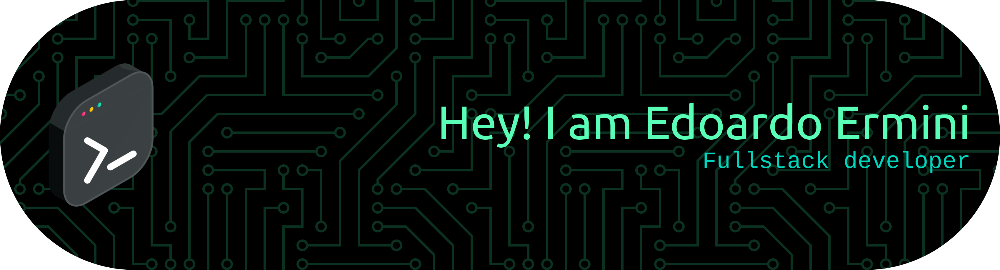

<!-- Profile Banner -->

  

<!-- Title & Intro -->
<h1 align="center">Hi, I'm Edoardo Ermini 👋</h1>
<h3 align="center">🚀 Freelance Fullstack Developer | React • Tailwind • Django • Node.js • Flutter</h3>

  
  
  

---

### 💻 About Me

- 💼 Freelance full-stack software engineer with experience building **web apps, REST APIs, and mobile apps** from scratch to production
- 🛠️ Main stack: **React**, **Tailwind CSS**, **Django**, **Node.js**, **Flutter**
- 🔐 Background in **network security** and **system programming** (Go, Python, C)
- 🌍 Open to **remote collaborations** and **long-term contracts**
- 🎯 Focused on **performance, clean architecture, and maintainable code**

---

### 🛠 Tech Stack

**Frontend**  

**Backend**  

**Infra & Tools**  

---

### 🔭 Open Source

| Project | Description | Stars |
|---------|-------------|-------|
| [**gonmap**](https://github.com/edoermini/gonmap) | Go package for interacting with nmap programmatically | ⭐ 18 |
| [**DoSTect**](https://github.com/edoermini/DoSTect) | SYN flooding DDoS detection system | ⭐ 8 |
| [**batman**](https://github.com/edoermini/batman) | Blockchain Advanced Threats and Malwares Aggregator Network | - |

---

### 📈 GitHub Stats

  
  

  

---

### 🤝 Let's work together

I'm available for **freelance projects** and **long-term remote contracts**.  
If you have an idea, a product to build, or a team that needs a fullstack developer — let's talk.

  <a href="mailto:edo.ermini@gmail.com">📩 edo.ermini@gmail.com</a> •
  <a href="https://www.linkedin.com/in/edoardo-ermini-64454b146/">💼 LinkedIn</a> •
  <a href="https://edoardoermini.dev">🌐 edoardoermini.dev</a>

